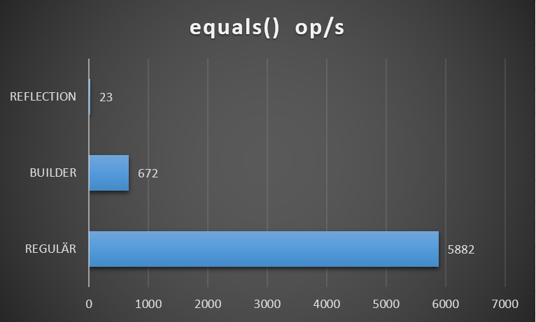
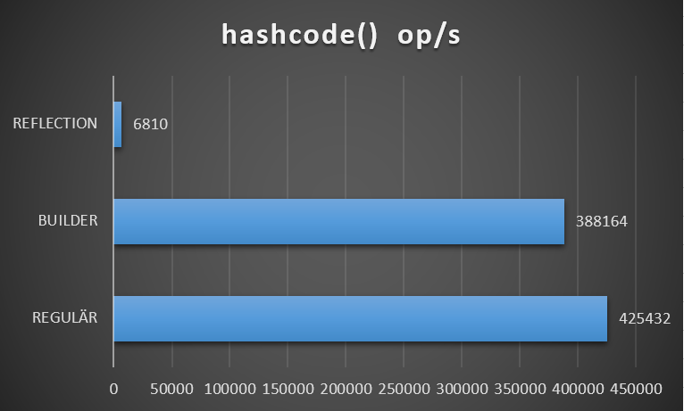

# example-hashcode-equals-test

In diesem Beispielprojekt werden verschiedene Möglichkeiten die equals- und hashcode-Methoden zu überschreiben getestet.

1. Regular - Generierung mit IDE (Eclipse)
2. Reflection - Verwendung von HashCodeBuilder und Equalsbuilder aus Apache Commons 3
3. Builder - Verwendung von HashCodeBuilder und Equalsbuilder aus Apache Commons 3

### *Ziel:* Rausfinden, wie stark sich die verschiedenen Methoden softwaretechnisch aber auch in der Ausführungsgeschwindigkeit unterscheiden


### Benchmark
```
Benchmark                                         Mode  Cnt       Score       Error  Units
HashcodeEqualsBenchmark.testEquals_Builder       thrpt    9     672,513 ±    27,769  ops/s
HashcodeEqualsBenchmark.testEquals_Reflection    thrpt    9      23,128 ±     1,434  ops/s
HashcodeEqualsBenchmark.testEquals_Regular       thrpt    9    5882,242 ±   202,038  ops/s
HashcodeEqualsBenchmark.testHashcode_Builder     thrpt    9  388164,619 ±  7000,510  ops/s
HashcodeEqualsBenchmark.testHashcode_Reflection  thrpt    9    6810,513 ±   517,025  ops/s
HashcodeEqualsBenchmark.testHashcode_Regular     thrpt    9  425432,583 ± 14447,940  ops/s
```





### Verwendete Bibliotheken
###### Apache Commons Lang

Aus dieser [Apache Bibliothek] (https://commons.apache.org/proper/commons-lang/) werden die Klassen ```HashCodeBuilder``` und ```Equalsbuilder``` verwendet. Mit Hilfe dieser Klassen können ```equals``` und ```hashcode```-Methoden entweder über Reflection oder Builder erstellt werden:

Reflection 
```java
@Override
public int hashCode() {
    return HashCodeBuilder.reflectionHashCode(this);
}

@Override
public boolean equals(Object obj) {
    return EqualsBuilder.reflectionEquals(this, obj);
}
```

Builder
```java
@Override
public int hashCode() {
    HashCodeBuilder b = new HashCodeBuilder();
    b.append(this.id);
    b.append(this.name);
    [...]
    return b.toHashCode();
}

@Override
public boolean equals(Object obj) {
    if (this == obj) {
        return true;
    }
    if (!(obj instanceof PersonWithBuilder)) {
        return false;
    }
    PersonWithBuilder o = (PersonWithBuilder)obj;
    EqualsBuilder b = new EqualsBuilder();
    b.append(this.id, o.id);
    [...]

    return b.isEquals();
}
```

Maven koordinaten:
```xml
<dependency>
    <groupId>org.apache.commons</groupId>
    <artifactId>commons-lang3</artifactId>
	<version>3.4</version>
</dependency>
```

###### EqualsVerifier
Mit Hilfe der Bibliothek [EqualsVerifier] (http://jqno.nl/equalsverifier/), können Java-Klassen getestet werden, ob die Methoden ```equals``` und ```hashcode``` richtig implementiert sind:

```java
@Test
public void testEqualsAndHashCode_Regular() {
    EqualsVerifier.forClass(PersonRegular.class)
    .suppress(Warning.STRICT_INHERITANCE, Warning.NONFINAL_FIELDS)
    .withRedefinedSuperclass()
    .verify();
}
```
EqualsVerifier erstellt Instanzen der Klasse, initialisiert alle Felder und führt schließlich equals- und hashcode-Tests aus.

Maven koordinaten:
```xml
<dependency>
	<groupId>nl.jqno.equalsverifier</groupId>
	<artifactId>equalsverifier</artifactId>
	<version>2.1.6</version>
	<scope>test</scope>
</dependency>
```

###### jmh
Sehr gute [Benchmarkbibliothek] (http://openjdk.java.net/projects/code-tools/jmh/) zur Messung der Ausführungsgeschwindigkeit. Siehe code


